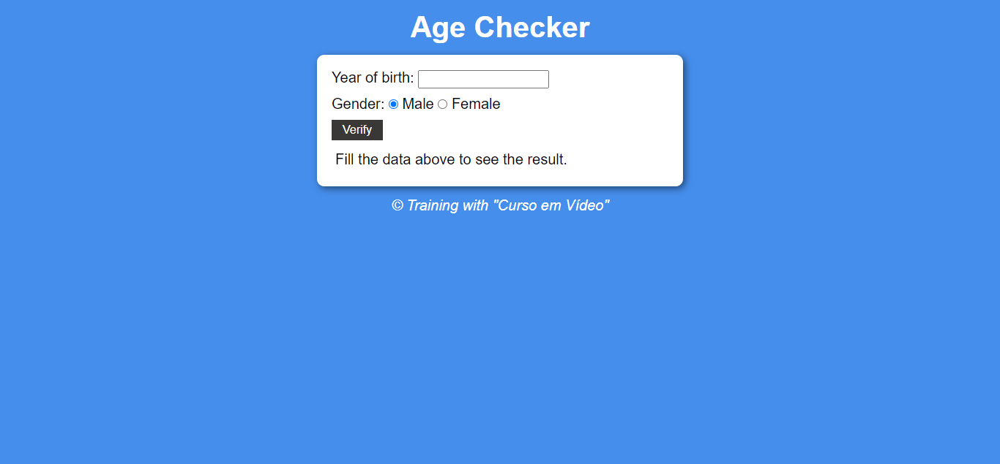
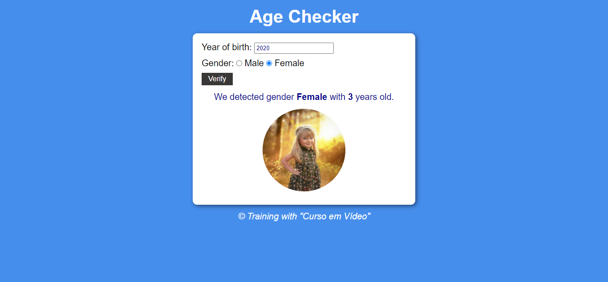
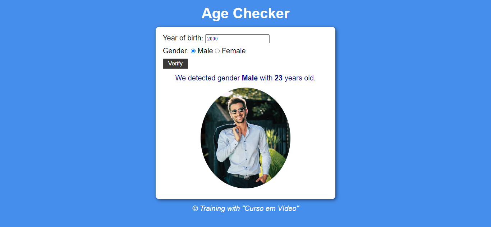
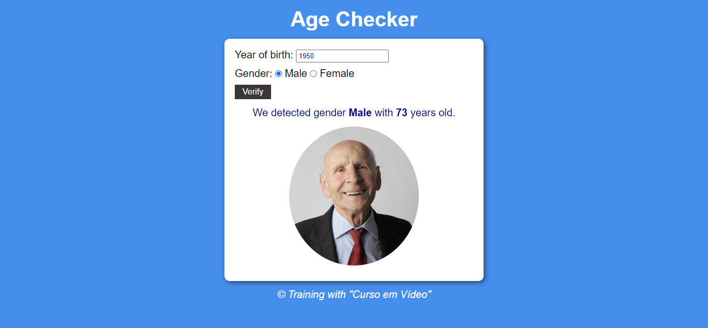

# Project: Age Checker

Project developed during the JavaScript Course with Gustavo Guanabara ("Curso em Vídeo"), in March/23.

According to the birth year input, the project checks the gender and age, changing some elements of the page, such as: gender and age message, image related to gender and age.

🔗 [Click here to access](https://renato-albuquerque.github.io/agechecker-jscourse-gustavoguanabara/)

## Technologies

- HTML
- CSS
- JavaScript
- Git and Github

## Contact

🔗 [Linkedin](https://www.linkedin.com/in/renato-malbuquerque/)
🔗 [Discord](https://discordapp.com/users/992621595547938837)
🔗 [Business Card](https://rma-contacts.vercel.app/)
🔗 [Portfolio](https://portfolio-renatoalbuquerque.vercel.app/)